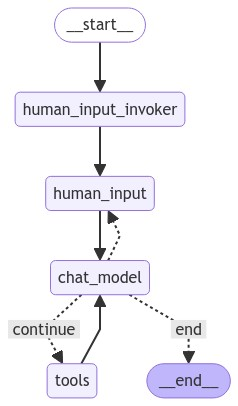

## Description of chat workflow graph

- Always **START** with the `human_input_invoker` node which is mostly the same as
the `chat_model` node, the only difference being it appends a `HumanMessage` to
the conversation invoking the `human_input` tool with a prompt.
- Output of the `human_input` tool i.e. the user's message is passed to the `chat_model` node 
- `chat_model` node responds to the user message by invoking the LLM resulting 
in tool calling or chat response. This node has following edges:
  - A conditional edge from `chat_model` to invoke tools
  - An edge from the `chat_model` to `human_input` to allow for a 
  [human-in-the-loop](https://langchain-ai.github.io/langgraph/concepts/agentic_concepts/#human-in-the-loop) 
  flow.
  - Finally, once the LLM signals an **END**, end the session
- An edge from `tools` node to `chat_model` allows for tools to invoke the LLM.
